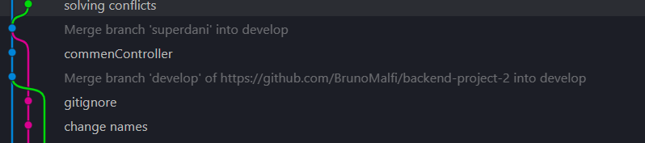

# PROYECTO BACKEND CON MONGOOSE

## Tabla de Contenidos

1. [Instalación](#instalación)
2. [Uso](#uso)
3. [Tecnologías](#tecnologías)
4. [Documentación](#documentación)
5. [Autores](#autores)

## Instalación

1. **Clonar el repositorio:**

2. **Instalar dependencias:**
   npm install

## Tecnologías

-   **Node.js**: Plataforma de tiempo de ejecución de JavaScript para construir el backend de la aplicación.
-   **Express.js**: Framework web de Node.js para crear aplicaciones web y APIs de manera rápida y sencilla.
-   **MongoDB**: Base de datos NoSQL utilizada para almacenar y gestionar los datos de la aplicación.
-   **Mongoose**: Biblioteca de modelado de datos para MongoDB en Node.js, que proporciona una solución simple pero potente para trabajar con bases de datos MongoDB.
-   **Postman**: Herramienta de colaboración para el desarrollo de APIs que permite probar, documentar y compartir APIs de manera eficiente.
-   **npm**: Administrador de paquetes de Node.js utilizado para instalar y administrar las dependencias del proyecto.
-   **Jsonwebtoken**:es una biblioteca de JavaScript que permite la creación, firma y verificación de tokens de JSON Web Tokens (JWT), los cuales son utilizados para la autenticación y autorización en aplicaciones web y servicios API.
-   **Bcryptjs**:Una biblioteca de JavaScript que proporciona funciones de hashing de contraseñas seguras utilizando el algoritmo bcrypt.
-   **Nodemon**:Una herramienta de desarrollo para aplicaciones Node.js que reinicia automáticamente el servidor cuando detecta cambios en los archivos del proyecto, lo que facilita el proceso de desarrollo.

Estas tecnologías y herramientas proporcionan una base sólida para construir una API robusta y escalable para tu aplicación de red social.

## Uso

La API está lista para ser utilizada. Los endpoints pueden ser probados utilizando herramientas como Postman o mediante solicitudes HTTP desde tu aplicación cliente.

Asegúrate de consultar la documentación de los endpoints para obtener información detallada sobre cómo utilizar cada uno.

## Documentación

## Autores

-   Bruno Malfi [@BrunoMalfi](https://github.com/BrunoMalfi)

-   Daniella Barraza [@DaniellaBarraza125](https://github.com/DaniellaBarraza125)
