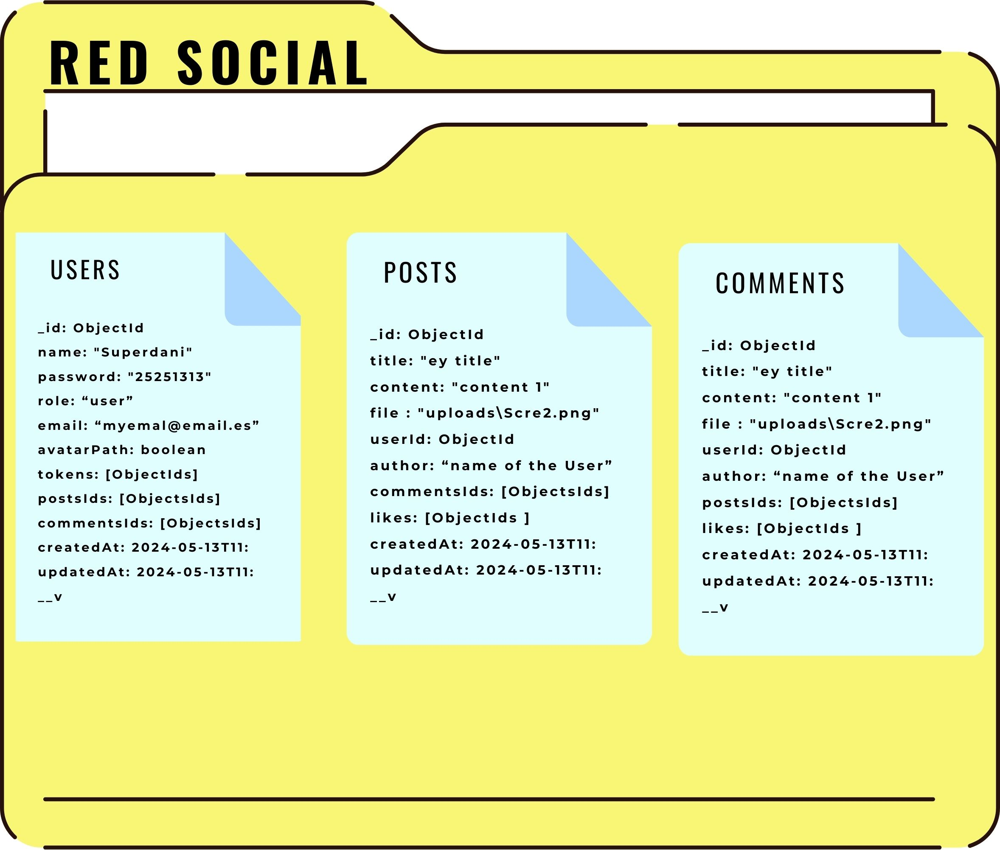
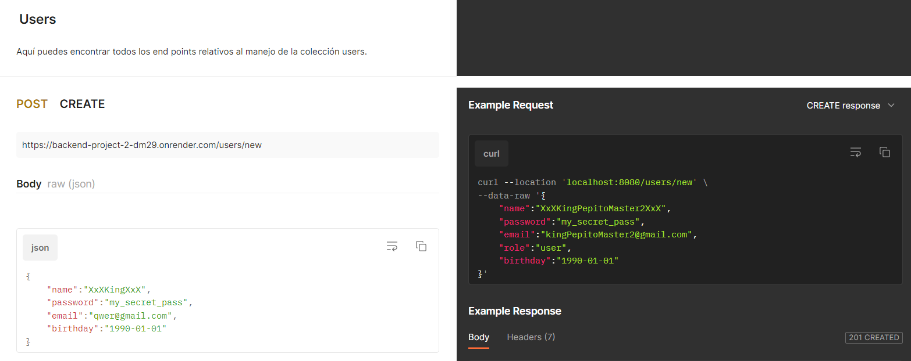
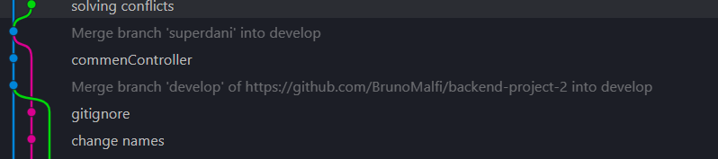

# PROYECTO BACKEND CON MONGOOSE 📃🧮

## Tabla de Contenidos

1. [Instalación](#instalación)
2. [La API](#laapi)
3. [Tecnologías](#tecnologías)
4. [Documentación](#documentación)
5. [Autores](#autores)

## Instalación ⚒🛠

1. **Clonar el repositorio:**

2. **Instalar dependencias:**
   npm install

## Tecnologías 🎮💻

-   **Node.js**: Plataforma de tiempo de ejecución de JavaScript para construir el backend de la aplicación.
-   **Express.js**: Framework web de Node.js para crear aplicaciones web y APIs de manera rápida y sencilla.
-   **MongoDB**: Base de datos NoSQL utilizada para almacenar y gestionar los datos de la aplicación.
-   **Mongoose**: Biblioteca de modelado de datos para MongoDB en Node.js, que proporciona una solución simple pero potente para trabajar con bases de datos MongoDB.
-   **Postman**: Herramienta de colaboración para el desarrollo de APIs que permite probar, documentar y compartir APIs de manera eficiente.
-   **npm**: Administrador de paquetes de Node.js utilizado para instalar y administrar las dependencias del proyecto.
-   **Jsonwebtoken**:es una biblioteca de JavaScript que permite la creación, firma y verificación de tokens de JSON Web Tokens (JWT), los cuales son utilizados para la autenticación y autorización en aplicaciones web y servicios API.
-   **Bcryptjs**:Una biblioteca de JavaScript que proporciona funciones de hashing de contraseñas seguras utilizando el algoritmo bcrypt.
-   **Nodemon**:Una herramienta de desarrollo para aplicaciones Node.js que reinicia automáticamente el servidor cuando detecta cambios en los archivos del proyecto, lo que facilita el proceso de desarrollo.
-   **Render** :una plataforma de alojamiento en la nube que simplifica el despliegue de aplicaciones y servicios web. Ofrece escalabilidad automática, soporte para diversas tecnologías y una interfaz fácil de usar, facilitando la administración y el mantenimiento de proyectos en producción.

## La API

Nuestra base de datos está diseñada para una red social y consta de tres colecciones principales: USERS, POST y COMMENTs.

En la colección POST, además del campo userId que indica quién ha creado la publicación, tenemos el campo commentsIds, que es una lista de IDs de los comentarios creados en el respectivo post.

Por otro lado, en la colección COMMENTs, además del campo userId que indica quién ha realizado el comentario, también tenemos el campo postId, que indica en qué publicación se realizó el comentario. Además, en la colección COMMENTs, el campo likes acumula los IDs de los usuarios que han dado like al comentario.

Esta estructura permite relacionar las publicaciones con los usuarios que las crearon, así como los comentarios con sus respectivas publicaciones y usuarios creadores. Además, registra la interacción de los usuarios con el contenido mediante el campo likes.

La API está lista para ser utilizada. Los endpoints pueden ser probados utilizando herramientas como Postman o mediante solicitudes HTTP desde tu aplicación cliente.

Asegúrate de consultar la documentación de los endpoints para obtener información detallada sobre cómo utilizar cada uno.

## Documentación 📊📊

 

Hemos elaborado nuestra documentación utilizando Postman. En ella, se pueden encontrar todos los endpoints del servidor desplegado, disponible en la siguiente URL: [https://backend-project-2-dm29.onrender.com]

https://documenter.getpostman.com/view/34760486/2sA3JNZzw4

## Autores 🎉

# Primera fila Izquierda

-   Bruno Malfi [@BrunoMalfi](https://github.com/BrunoMalfi)

-   Daniella Barraza [@DaniellaBarraza125](https://github.com/DaniellaBarraza125)
